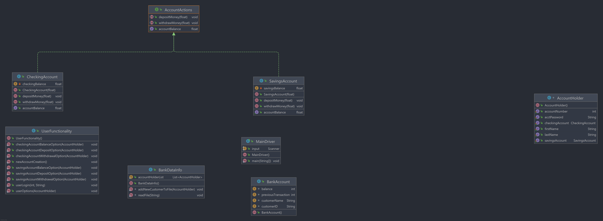

# java-project-1
1. Technologies used
a. IntelliJ
b. Slack
c. Calling and using Methods
d. Github
e. YouTube

2. User Stories

i.	As a user, I would like to have be able to open a checking or Savings account

ii.	As a user, if I provide my login and password, let me access my account. 
If the user  

iii.	As a user, I would like to set up a username and password to access my bank account
information. 

iv.	As a user, I would like access to check my account balance by logging in with my username and password.

v.	As a user, I would like to be able to deposit funds into my checking or savings account 

vi.	As a user, I would to be able to transfer funds between my checking account and savings account. 

3. Planning stages
a.	Creating an outline with user stories
b.	Researching and gathering sources such as Stack Overflow, Leetcode, Oracle Docs, GitHub repositories and general Google searches. 
c.	List features in the Want category and those in the Need category.
    Started with great confidence and immediately collapsed under pressure. Mentally re-started the process and began writing code methods one by one until I saw progress being made. I was able to complete a major portion of the assignment with guidance and resolve. Product came together after several failed attempts and a sign of relief finally settled in with a somewhat working code. Excitement and accomplishment followed. 

4. Unresolved problems

a.	Prompting user to login using custom access, i.e. not Suresh account. 

b.	Adding additional features such as overdraft protection and transfer from one account to another. 

c.	Better menu choice options for actual account user. 

d.	Better menu option for a new account user. 

5.	Favorite methods was the switch choice inside the UserOptions for checking or savings account. This let me deposit, withdrawal and check balance within the same code. 

